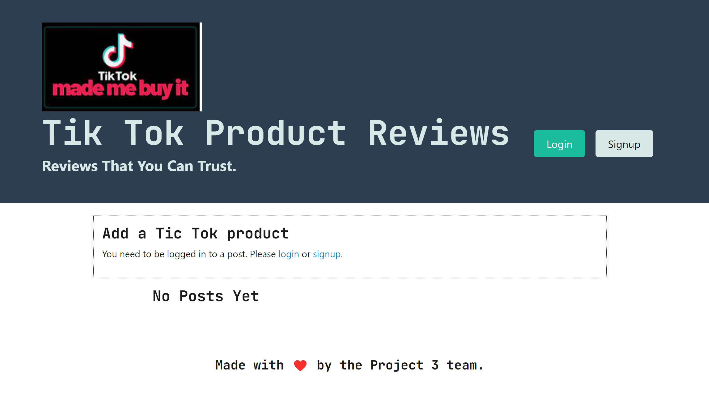

# Tik Tok Made Me Buy It!

## Description

 This is MERN stack single-page application that works with real-world data to solve a real-world challenge, with a focus on data and user demand. What we have created is a simple MERN application that allows user login in criteria to create reviews on viral senstation products shown on Tik Tok.

## Table of Contents

- [Usage](#usage)
- [Credits](#credits)
- [License](#license)

## Usage

* This application uses React for the front end.
* This application uses GraphQL with a Node.js and Express.js server.
* This application uses MongoDB and the Mongoose ODM for the database.
* This application uses queries and mutations for retrieving, adding, updating, and deleting data.
* This application is deployed using Heroku (with data).
* This aplication has a polished UI, is responsive and is interactive (i.e., accept and respond to  user input).
* This application includes authentication (JWT) and protects sensitive API key information on the server.
* This application has a clean repository that meets quality coding standards (file structure, naming conventions, best practices for class and id naming conventions, indentation, high-quality comments, etc.).

    

## Credits
<a href="https://github.com/gnimelf"> Justin Fleming

<a href="https://github.com/tgallagher496">  Tammy Gallagher

<a href="https://github.com/y2kRULEZ"> Iman Pace

<a href="https://github.com/tajajones2"> Taja Jones

</a>

## License

Copyright (c) 2022 

Permission is hereby granted, free of charge, to any person obtaining a copy of this software and associated documentation files (the "Software"), to deal in the Software without restriction, including without limitation the rights to use, copy, modify, merge, publish, distribute, sublicense, and/or sell copies of the Software, and to permit persons to whom the Software is furnished to do so, subject to the following conditions:

The above copyright notice and this permission notice shall be included in all copies or substantial portions of the Software.

THE SOFTWARE IS PROVIDED "AS IS", WITHOUT WARRANTY OF ANY KIND, EXPRESS OR IMPLIED, INCLUDING BUT NOT LIMITED TO THE WARRANTIES OF MERCHANTABILITY, FITNESS FOR A PARTICULAR PURPOSE AND NONINFRINGEMENT. IN NO EVENT SHALL THE AUTHORS OR COPYRIGHT HOLDERS BE LIABLE FOR ANY CLAIM, DAMAGES OR OTHER LIABILITY, WHETHER IN AN ACTION OF CONTRACT, TORT OR OTHERWISE, ARISING FROM, OUT OF OR IN CONNECTION WITH THE SOFTWARE OR THE USE OR OTHER DEALINGS IN THE SOFTWARE.

## Badges

